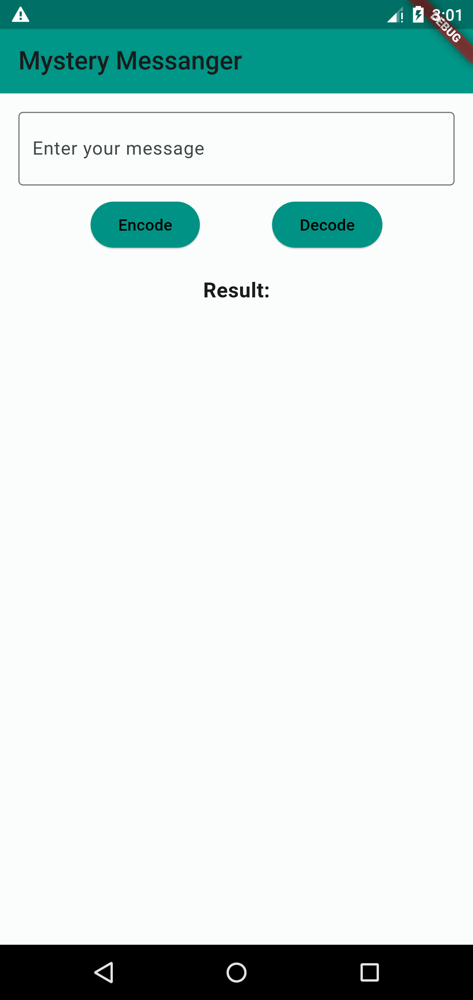

# Mystery Messenger

Mystery Messenger is a Flutter application that allows users to encode and decode messages using the Caesar cipher. The app provides a simple and intuitive interface for users to enter their messages, encode or decode them, and view the results. 

## Features

- **Simple UI**: A user-friendly interface for entering and viewing messages.
- **Responsive Design**: Adapts seamlessly to different screen sizes.

## Screenshots

### Splash Screen

### Home Screen

## Usage

1. Launch the app to see the splash screen.
2. On the home screen, enter your message in the text field.
3. Press "Encode" to encode your message or "Decode" to decode it.
4. The result will be displayed below the buttons.

## Download APK

You can download the APK for Mystery Messenger [here](https://github.com/aabaidali/Mystery_Messanger/archive/refs/tags/APk.zip).

## Contributing

Contributions are welcome! Please fork the repository and submit a pull request.

## Author

**Unknown**
---

*Designed and Developed by searching...*
